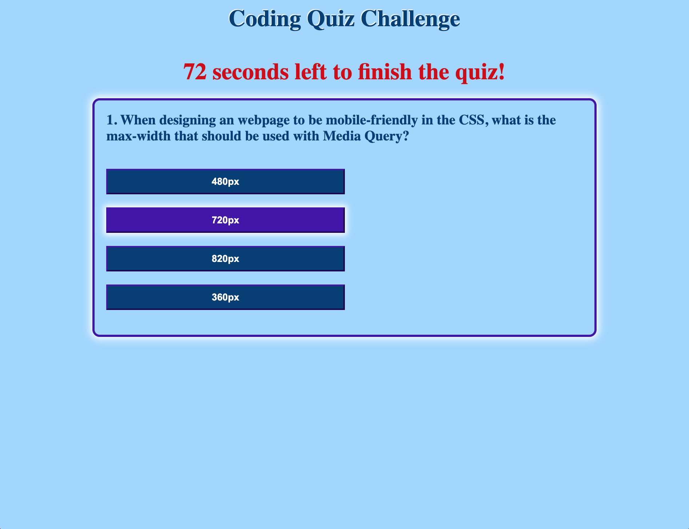

Welcome to the Coding Quiz Challenge!

With this short quiz, you can test yourself on some key points that were covered in the first few weeks of the bootcamp. You can save your score and also retake the quiz an unlimited number of times, which can be helpful as you gauge your progress and compare your performance to that of your peers!

Some features that will be coming soon:
- Larger question set
- Randomization of the selected questions from the question set
- Randomization of the displayed answer choice order
- More interaction available with Highscores section

Screenshot of Quiz:

Links:
https://mistahv.github.io/CodingQuiz/ (application)
https://github.com/MistahV/CodingQuiz.git (git code)

Created by Christopher Van Etten